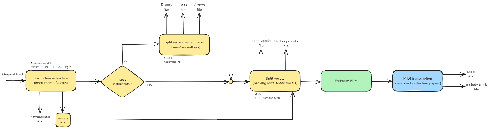
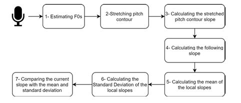
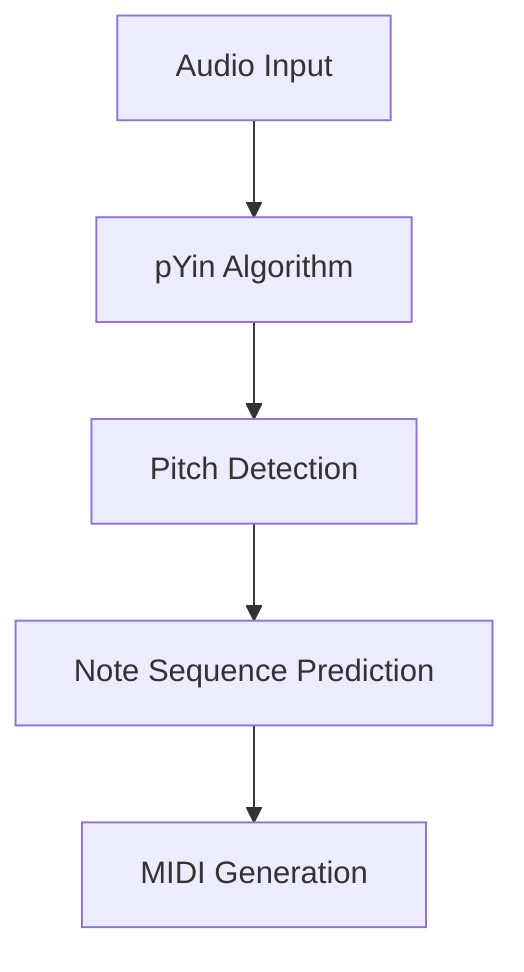

# Velody (Music Recommendation and MIDI Extraction App)

## 🎥 Demo

[](https://www.youtube.com/watch?v=LKfWj7dMsFg)

Watch our application demo on YouTube to see the music recommendation and MIDI extraction features in action.

## 📊 System Architecture

### Audio Processing Pipeline

*Complete pipeline showing stem separation, vocal processing, and MIDI extraction*

### MIDI Extraction Flow

*Step-by-step process of MIDI note extraction from audio*

## 🎵 Overview

A full-stack web application built with Nx monorepo architecture that provides music recommendations and MIDI extraction capabilities. The app uses LastFM and MusicBrainz APIs for music recommendations and implements advanced audio processing for MIDI conversion.

## ✨ Features

* Music recommendation based on artist and song input
* Genre-based filtering
* Audio processing and MIDI extraction
* Piano roll visualization of extracted MIDI notes
* Vocal and instrumental stem separation

## 🛠️ Tech Stack

### Frontend
* React
* Vite (bundler)
* Nx (monorepo)

### Backend
* Flask (Python)
* Audio processing libraries:
  * MDX23C-8KFFT-InstVoc_HQ_2 (stem separation)
  * htdemucs_ft (instrumental separation)
  * 6_HP-Karaoke-UVR (vocal separation)
  * librosa (audio processing)
  * pYin (pitch detection)

## 🚀 Getting Started

### Prerequisites

```bash
# Make sure you have Node.js and Python installed
node --version
python --version
```

### Frontend Setup

```bash
# Install dependencies
npm install

# Start the frontend application
nx serve frontend
```

### Backend Setup

```bash
# Navigate to backend directory
cd apps/backend

# Install Python dependencies
pip install -r requirements.txt

# Start the backend server
nx serve backend
```

## 🏗️ Architecture

### Music Processing Pipeline

1. **Stem Separation**
   * Splits audio into instrumental and vocal components
   * Uses MDX23C-8KFFT-InstVoc_HQ_2 model

2. **Voice Separation**
   * Further separates vocals into lead and backing tracks
   * Implements 6_HP-Karaoke-UVR model

3. **MIDI Extraction**
   * Fundamental frequency detection
   * Onset detection
   * Hidden Markov Model processing
   * MIDI file generation

### API Integration

* **LastFM API**: 
  * Music recommendations
  * Metadata retrieval
* **MusicBrainz API**: 
  * Additional music information
  * Genre filtering capabilities

## 💻 Usage

1. Enter an artist and song name in the search interface
2. Apply genre filters if desired
3. Select a recommended song from the results
4. Click "Process Sound" to:
   * Extract MIDI information
   * View piano roll visualization
   * See melody contour analysis

## 🔧 Technical Details

### MIDI Extraction Process



#### Key Components:

* **Pitch Detection**
  * Uses pYin algorithm
  * Frequency range: C2 to C6
  * Frame size: 46ms

* **Note Processing**
  * Hidden Markov Models for sequence prediction
  * Onset-offset detection optimized for vocals
  * BPM detection for timing accuracy

* **Visualization**
  * Multi-layer canvas approach
  * Piano roll display
  * Melody contour analysis

### Audio Processing Features

* **Stem Separation**
  ```plaintext
  Original Track
  ├── Instrumental
  │   ├── Drums
  │   ├── Bass
  │   └── Other
  └── Vocals
      ├── Lead
      └── Backing
  ```

## 🤝 Contributing

1. Fork the repository
2. Create your feature branch (`git checkout -b feature/AmazingFeature`)
3. Commit your changes (`git commit -m 'Add some AmazingFeature'`)
4. Push to the branch (`git push origin feature/AmazingFeature`)
5. Open a Pull Request

## 📝 License

[MIT License]

## 🙏 Acknowledgments

* LastFM API
* MusicBrainz API
* Audio processing libraries maintainers
